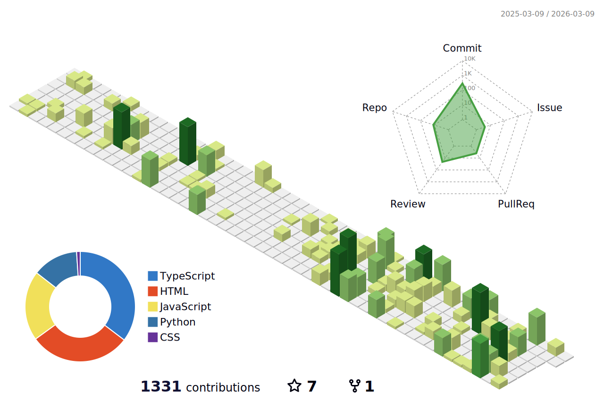

  
  
  

  

### My Projects

[**More than 10 Projects**](https://github.com/Huskynarr) — Only at request.  

### Social Media

[View my personal blog: **huskynarr.de**](https://huskynarr.de/)  
[Follow me on twitter: **@huskynarr**](https://twitter.com/Huskynarr)

<!--
Here are some ideas to get you started:

- 🔭 I’m currently working on ...
- 🌱 I’m currently learning ...
- 👯 I’m looking to collaborate on ...
- 🤔 I’m looking for help with ...
- 💬 Ask me about ...
- 📫 How to reach me: ...
- 😄 Pronouns: ...
- ⚡ Fun fact: ...
-->

<!--
**Huskynarr/Huskynarr** is a ✨ _special_ ✨ repository because its `README.md` (this file) appears on your GitHub profile.

Here are some ideas to get you started:

- 🔭 I’m currently working on ...
- 🌱 I’m currently learning ...
- 👯 I’m looking to collaborate on ...
- 🤔 I’m looking for help with ...
- 💬 Ask me about ...
- 📫 How to reach me: ...
- 😄 Pronouns: ...
- ⚡ Fun fact: ...
-->

Tools to generated this page:
- https://leviarista.github.io/github-profile-header-generator/
- https://github.com/rzashakeri/beautify-github-profile
