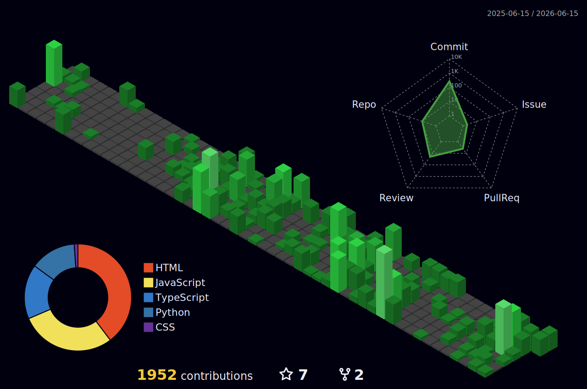

<div align="center">

  

  # 🌲 `<Huskynarr />`
  ### *Entwickler · Creator · Streamer*
  
  **`From Blackforest with <3`**

  <br/>

  [](https://huskynarr.is-a.dev)

</div>

<br/>

```typescript
/**
 * @name Huskynarr
 * @role Developer, Tech-Enthusiast & Content Creator
 * @origin Black Forest, Germany 🌲
 * @motto "From Blackforest with <3"
 */

class Developer extends Nerd {
  public name: string = "Huskynarr";
  public status: string = "Building interactive 3D Web apps & curating hardware/robotics directories";
  public stack: string[] = ["JavaScript", "TypeScript", "Three.js", "WebGL", "React", "Astro", "HTML/CSS"];
  public interests: string[] = ["3D Visualizations", "Robotics Databases", "AR/XR Tech", "Sci-Fi UI Concepts"];
  
  public getPhilosophy(): string {
    return "Combining clean code, creative web technologies, and interactive experiences.";
  }
}
```

---

### 💻 Tech Stack & Tools

<div align="center">


</div>

---

### 🚀 Highlight Projects & Web Apps

Eine Auswahl meiner interaktiven 3D-Projekte, Vergleichs-Datenbanken und Plattformen (mehr auf [huskynarr.is-a.dev](https://huskynarr.is-a.dev/)):

| Projekt | Beschreibung | Tech / Tags | Link |
| :--- | :--- | :--- | :---: |
| 🤖 **Robotics Directory** | Umfangreiche Datenbank & Vergleichstool für über 1000 Roboter (Humanoiden, Roboterhunde, Haushaltshelfer). | `DATENBANK` `ASTRO` | [Launch ↗](https://robodirectory.huskynarr.de/) |
| 🥽 **AR/XR Directory** | Kuratierter Vergleich von über 340 Augmented & Mixed Reality Brillen mit Specs & EOL-Status. | `HARDWARE` `VERGLEICH` | [Open ↗](https://ar-directory.huskynarr.de/) |
| 🚐 **e-Stealth Camper** | Interaktives 3D-Konzept eines elektrischen Postautos (StreetScooter Work L) ausgebaut als Camper. | `THREE.JS` `3D CONCEPT` | [View 3D ↗](https://huskynarr.is-a.dev/wohnmobil/) |
| 🏪 **Neo-Store Concept** | Interaktive 3D-WebGL-Umgebung mit Cyber-Bar, Makerlab, Coworking-Bereich und 24/7 Automaten-Shop. | `WEBGL` `3D STORE` | [Enter ↗](https://huskynarr.is-a.dev/storeidea/) |
| 🛡️ **MJOLNIR Field Manual** | Interaktiver Guide & Schritt-für-Schritt-Anleitung für den Bau eines Halo Master Chief Cosplays. | `TUTORIAL` `SCI-FI` | [Tutorial ↗](https://huskynarr.is-a.dev/HaloCosplay/) |
| 🧠 **AQ-50 & Autism Platform** | Evidenzbasierte Online-Screening-Plattform & Autismus-Spektrum-Quotient Tests. | `REACT` `SCREENING` | [Platform ↗](https://huskynarr.is-a.dev/autism-tests/) |
| 🎓 **ISTQB Master Trainer** | Interaktiver Zertifizierungstrainer für die ISTQB Certified Tester Foundation Level Prüfung. | `EDUCATION` `TESTING` | [Start ↗](https://huskynarr.is-a.dev/istqb-testing/) |
| 🔐 **Ottendorf-Verschlüsselung** | Interaktives Webtool zur Demonstration der historischen Buchverschlüsselung. | `KRYPTO` `WEBTOOL` | [Open ↗](https://huskynarr.is-a.dev/Ottendorf/) |

---

### 📊 Telemetry & GitHub Statistics

<div align="center">



<br/>

<a href="https://github.com/anuraghazra/github-readme-stats">
  
</a>
<a href="https://github.com/anuraghazra/github-readme-stats">
  
</a>

<br/><br/>

[](https://git.io/streak-stats)

</div>

---

### 🌐 Connect with Huskynarr

<div align="center">

[](https://huskynarr.de)
[](https://huskynarr.is-a.dev)
[](https://huskynarr.shop)
[](https://discord.gg/huskynarr)
[](https://youtube.com/@huskynarr)
[](https://twitch.tv/huskynarr)
[](https://tiktok.com/@huskynarr)
[](https://instagram.com/huskynarr)
[](https://x.com/huskynarr)
[](https://keybase.io/huskynarr)

</div>

<br/>

<div align="center">
  <sub>Made with ❤️ in the Black Forest · &copy; 2026 Huskynarr</sub>
</div>

